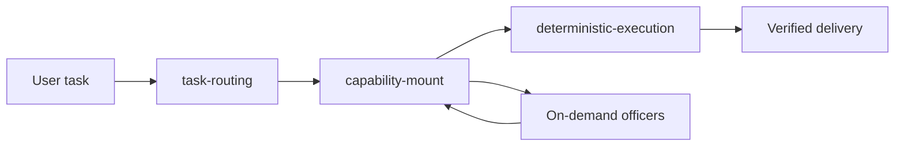

# Wuji Legion for Codex / 无极军团

> A system-level Codex meta-skill that distills the strongest parts of many skills, agents, plugins, and workflows into small atoms, then routes, mounts, audits, and verifies them through one main chain.
>
> 一个面向 Codex 的系统级总 skill：把多来源能力拆成原子，只保留值得补缺、替换或增强的部分，再交给唯一主链统一路由、挂载、审计、验证和交付。

Current version: `v11.3`  
Truth source: `kernel-source.json`

## What It Is / 它是什么

Wuji Legion is not a role-play prompt pack and not a pile of disconnected skills. It is a single-kernel Codex runtime mirror that absorbs useful atoms from OpenSquilla, Headroom, Reasonix, Superpowers, research tools, PPT systems, audit workflows, root-cause repair patterns, and visual design sources.

无极军团不是“多角色聊天皮肤”，也不是一堆 skill 的简单相加。它是一个单内核的 Codex 运行镜像：把 OpenSquilla、Headroom、Reasonix、Superpowers、调研工具、PPT 系统、审计流程、根因修复方法和视觉设计来源中的有效能力拆成原子，经过优胜劣汰后融入唯一主链。

## Core Selling Points / 核心卖点

- **Single main chain / 唯一主链**: one route owner, one merge point, one write authority.
- **Codex-only execution / 只在 Codex 内执行**: external projects may inspire atoms, but they do not become a second executor.
- **Sparse activation / 稀疏激活**: only the owner profile, triggered officers, selected skill, and evidence handles enter context.
- **Lower total cost / 降低总体成本**: optimize cached input, fresh input, output, retries, and tokens per success together.
- **Root-cause first / 根因优先**: reduce patch debt instead of stacking local fixes.
- **Prior-art first / 先找现成方案**: search proven tools, docs, issues, and implementations before inventing a mechanism when the answer is not obvious.
- **Deterministic Go base / Go 确定性底座**: `wuji-cli` provides repeatable routing, audits, gates, and closeout checks.
- **Real-run completion / 真实验收**: completion claims require current evidence, not just explanation.

## Architecture / 架构



Main chain:

1. `task-routing`
2. `capability-mount`
3. `deterministic-execution`

A second router is forbidden. A second command authority is forbidden. An
always-on shell or external executor is forbidden.

## Independent Officers / 独立官

- `white-hat`
- `guard-office`
- `root-cause-officer`
- `root-cause officer`
- `audit`
- `quality-inspection`
- `performance-benchmark-on-demand`
- `compliance-on-demand`

They are explicit, on-demand review seats. They can reject, return, or set release conditions, but they do not directly edit files or become a second commander.

## Distilled Atoms / 蒸馏原子

Resident light atoms:

- `assumption-ledger`
- `claim-fact-check`
- `reversible-evidence-handle`
- `content-type-compression-router`

On-demand atoms include:

- `version-doc-mcp`
- `guarded-realtime-source-search`
- `research-evidence-pack`
- `skill-stocktake-daily-library`
- `verified-learning-loop`
- `disciplined-debug-loop`
- `prior-art-solution-search`
- `root-cause-radar`
- `parallel-hypothesis-fanout`
- `patch-debt-root-cure`
- `terminal-real-run-verification`
- `native-pptx-master-route`
- `motion-stage-sprite-engine`

Marker: `distilled_atom_kernel`

## Current Source-Pool Rulings / 当前候选池裁决

Object-level final verdicts are machine-tracked in `fusion-matrix.json -> object_verdicts`. This summary is only the readable mirror.

- `Headroom`: `replace + landed` for compression and token discipline.
- `Superpowers` is gap-fill-only in source-pool terms, and its landed value is limited to disciplined debugging, verification loops, parallel hypothesis fanout, and patch-debt repair atoms.
- `AnySearch`: `gap-fill + landed` into guarded realtime source search.
- `Ponytail`: `reject + rejected`; useful YAGNI and smallest-change lessons are already covered by existing concise execution and patch-debt atoms.
- `Agent-Reach`: `defer + source-pool-only`; keep wide-source reach as candidate mapping only, with no default crawler, cookies, accounts, or ToS-bypass runtime.
- `codebase-memory-mcp`: `gap-fill + source-pool-only`; may be tested only as a read-only, on-demand code-structure memory accelerator after source/build/hash, secret-filter, stale-index, and small-repo benchmark gates.
- `awesome-design-md`: `gap-fill + source-pool-only`; keep only a cold design-prior-art index, never resident brand/IP doctrine.
- `mattpocock/skills`: `gap-fill + source-pool-only`; keep examples-first, single-purpose skill-card patterns, reject the skill-pack shell.
- `agentic coding skills`: `gap-fill + source-pool-only`; keep task-scoped routing, review, and verification patterns, reject generic agent shells.
- `Claude loops`: `gap-fill + source-pool-only`; keep bounded-loop discipline only: budget, dedupe, stop condition, failure evidence, and real verification.
- `penpot`: `defer + source-pool-only`; possible external design reference/export tool, not a kernel runtime.
- `plane`: `reject + rejected`.
- `universal-android-debloater`: `reject + rejected`.
- `Agency Agents` is rejected.
- `gstack`: `reject + rejected`.

## Default Model Mirror / 默认模型镜像

- Low-cost search text route: `agnes-2.0-flash`
- Default image route: `agnes-image-2.1-flash`
- Default video route: `agnes-video-v2.0`
- If Agnes fails or is unavailable, the only allowed fallback is the default GPT route.
- If the user explicitly names another provider or model, that explicit request overrides the default Agnes preference.
- Agnes text is only for guarded web search, broad shallow scouting, and simple external evidence collection.
- Chat, drafting, planning, coding, docs, and high-risk verification stay on the stronger default GPT/developer path.

## Quick Start / 快速开始

### Clone and verify

```powershell
git clone https://github.com/AI-wuji/wuji-legion-codex.git
cd wuji-legion-codex
powershell -NoProfile -ExecutionPolicy Bypass -File scripts\ensure-wuji-cli.ps1 -RepoRoot .
powershell -NoProfile -ExecutionPolicy Bypass -File scripts\test-wuji-cli.ps1
```

### Install as a Codex skill

```powershell
powershell -NoProfile -ExecutionPolicy Bypass -File scripts\wuji-install.ps1 -Ref <40-char-commit-sha> -Bootstrap -InstallAgents
```

Install target:

```text
%USERPROFILE%\.agents\skills\wuji-legion
```

## Common Commands / 常用命令

```powershell
$routeReport = Join-Path $env:TEMP ("wuji-route-" + [guid]::NewGuid().ToString('N') + ".json")
.\.wuji-tools\wuji-cli.ps1 route-task --config config.json --query "fix bug" --report $routeReport
.\.wuji-tools\wuji-cli.ps1 fusion-audit --workspace .
.\.wuji-tools\wuji-cli.ps1 optimization-audit --workspace .
.\.wuji-tools\wuji-cli.ps1 context-bloat-audit --workspace .
```

## Release Discipline / 发布纪律

- Uncertain tasks scout wide and shallow first, with Agnes handling low-cost broad search before deep implementation begins; simple scoped work does not scout by default.
- Non-trivial goals lock scope, target surface, finish line, out-of-scope exclusions, and completion evidence before long execution starts.
- All non-chat execution work stays in the direct-task lane by default; planning and officers are mounted only when explicitly needed.
- Page or screen redesigns replace the active target surface in place: no parallel v2 page, compatibility wrapper, duplicate route, or hidden old entry unless explicitly requested.

Completion claims require current:

- `fusion-audit`
- `optimization-audit`
- `context-bloat-audit`

Token, cost, cache, backend usage, and outer-context claims also require `runtime-context-audit`.

Context skeleton and contracts:

- `hotpath-manifest.json`
- `concise_execution_contract`
- `execution_budget_contract`
- `analysis_completeness_contract`
- `complete-materials-before-architecture-analysis`
- `target-page-in-place-replacement`
- `parallel-compat-page-for-requested-page-change`

## Closeout Sound / 收口提醒

Non-FAST_REPLY work should try `scripts/beep.ps1 complete -SpawnDelayed -DelayMs 1200` before the final response. Sound failure is non-blocking.

## Support / 支持

If Wuji Legion helps your Codex workflow, a small donation keeps the project moving.

如果无极军团帮到了你，欢迎随手赞赏，支持继续打磨。

<p align="center">
  
</p>
