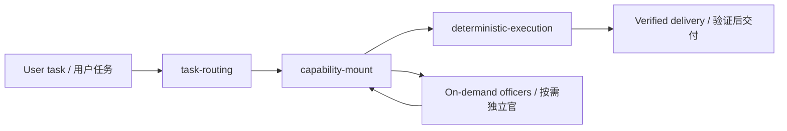

# Wuji Legion for Codex / 无极军团 Codex 版

> A Codex-native execution kernel for disciplined, audited, token-efficient AI work.
>
> 一个运行在 Codex 内部的 AI 执行内核：单主链、按需能力挂载、独立审查、低 token 总成本、真实验证后交付。

Current version: `v11.3`
Truth source: `kernel-source.json`

## Why Wuji Legion

无极军团不是“多角色聊天皮肤”。它是一套给 Codex 使用的任务执行操作系统：先路由，再按需挂载能力，再用 Go 执行底座做确定性门禁和验证。目标很简单：少兜圈、少返工、少烧 token，但不牺牲命中率、证据链和交付质量。

Wuji Legion is not a role-play prompt pack. It is a Codex-native task execution kernel: route the task, mount only the needed capabilities, then verify with deterministic Go gates. The goal is simple: fewer loops, less rework, lower total token cost, without weakening accuracy, evidence, or delivery quality.

## Core Selling Points / 核心卖点

- **Single main chain / 单一主链**: one routing authority, one merge point, no competing agent headquarters.
- **Codex-only execution / Codex 内执行**: OpenSquilla-style strengths are distilled into atoms, not kept as an external executor.
- **MoE-style sparse activation / MoE 式稀疏激活**: only the owner profile, triggered officers, selected skill, and evidence handles enter context.
- **Low total cost, not fake savings / 优化总成本而非假省 token**: `concise_execution_contract` gates cached, fresh, output, uncached tokens, retries, and tokens per success.
- **Execution budget contract / 执行预算契约**: `FAST_REPLY`, `LIGHT_TASK`, `STRUCTURAL_TASK`, and `RELEASE_TASK` stop small tasks from expanding into full-system scans.
- **Independent officers / 独立审查官**: white-hat, guard-office, root-cause officer, audit, quality-inspection, performance benchmark, and compliance stay separate and on-demand.
- **Root-cause over patching / 根因修复优先**: `root-cause officer`, `root-cause-radar`, `parallel-hypothesis-fanout`, and `patch-debt-root-cure` target causes instead of stacking local patches.
- **Deterministic Go gates / Go 确定性门禁**: `wuji-cli` provides repeatable audits, routing reports, context packing, benchmark checks, MCP guards, PPT gates, and closeout checks.
- **Real-run closeout / 真实运行后收口**: completion claims require current evidence, not just explanations or plans.

## Architecture / 架构



The fused kernel has exactly three layers:

1. `task-routing`
2. `capability-mount`
3. `deterministic-execution`

无极军团只有这三层主链。它不允许第二套路由、第二个用户入口、第二套外部执行系统，或绕过主链的并行总控。

Wuji Legion has only these three main-chain layers. It forbids a second router, a second user entry, an external execution system, or a parallel command authority.

## What It Distills / 它吸收了什么

Wuji Legion keeps useful ideas as atoms and rejects project-shell stacking.

无极军团只吸收原子能力，不叠加外部系统外壳。

- OpenSquilla-style task detection, capability gap detection, skill filtering, MCP awareness, and memory/session routines.
- Headroom/Reasonix-style token and hit-rate discipline.
- Prior-art search before invention.
- Root-cause analysis, patch-debt cleanup, and parallel hypothesis fanout.
- Context compression with evidence handles instead of replaying whole logs.
- Guarded MCP/plugin intake and source/security/compliance checks.

Marker: `distilled_atom_kernel`.

## Independent Officers / 独立官

Independent officers are explicit review seats, not simulated tones:

独立官是真正的审查席位，不是语气模拟：

- `white-hat`: challenge assumptions, catch fake fusion, check weak evidence.
- `guard-office`: screen external pages, repos, MCP manifests, plugins, scripts, dependencies, and assets.
- `root-cause-officer`: judge failure causes, low efficiency, rework, and patch debt.
- `audit`: check process truth, gates, and evidence chain.
- `quality-inspection`: final acceptance and real-run verification.
- `performance-benchmark-on-demand`: token, hit-rate, speed, cost, and resource measurement.
- `compliance-on-demand`: license, source, privacy, attribution, and release boundary.

They can reject, return, or set release conditions. They do not directly edit files or become a second commander.

## Token And Context System / Token 与上下文系统

Wuji Legion is built around a sparse context governor:

无极军团的省 token 不是“少看证据”，而是稀疏装配：

- `hotpath-manifest.json`: resident, on-demand, cold-ledger, and forbidden-resident surfaces.
- `context-bloat-audit`: rejects high cache-hit runs when cached volume, fresh input, output, loaded bytes, or activated roles exceed budget.
- `runtime-context-audit`: required only for token, cost, cache, backend usage, or outer-context claims.
- `bench-report`: binds the measured workspace, command, timestamp, log reference, and usage hash.
- Raw prompts, messages, content, secrets, sessions, keys, cookies, and tokens never enter resident reports.

Optimization markers: `fusion-audit`, `optimization-audit`, `context-bloat-audit`, `runtime-context-audit`, `execution_budget_contract`, `analysis_completeness_contract`, `complete-materials-before-architecture-analysis`, `reversible-evidence-handle`.

## Typical Use Cases / 适合场景

- Codex workflows that keep getting slow, bloated, or over-routed.
- AI coding tasks that need root-cause repair instead of another patch.
- Research tasks that need GitHub/source evidence without unsafe external execution.
- PPT, HTML, UI, visual, and document delivery that needs real QA gates.
- MCP/plugin adoption where security, privacy, source, and license boundaries matter.
- Teams that want AI agents to be auditable, sparse, and disciplined.

适合这些场景：

- Codex 经常兜圈、跑偏、上下文膨胀的项目。
- 修 bug 不想继续打补丁，而是要快速定位根因。
- 调研需要 GitHub、源码、证据句柄，但不想接入外部执行系统。
- PPT、HTML、UI、视觉、文档交付需要真实质检门禁。
- MCP/插件接入需要安全、隐私、来源、许可审查。
- 希望 AI agent 更可审计、更克制、更稳定的团队。

## Quick Start / 快速开始

### Clone and verify / 克隆并验证

```powershell
git clone https://github.com/AI-wuji/wuji-legion-codex.git
cd wuji-legion-codex
powershell -NoProfile -ExecutionPolicy Bypass -File scripts\ensure-wuji-cli.ps1 -RepoRoot .
powershell -NoProfile -ExecutionPolicy Bypass -File scripts\test-wuji-cli.ps1
```

Expected result:

```text
RESULT: PASS - wuji-cli deterministic gates
```

### Install as a Codex skill / 安装为 Codex skill

For supply-chain safety, the installer requires a pinned 40-character commit SHA.

为了供应链安全，安装脚本要求使用固定的 40 位 commit SHA，而不是浮动分支或 tag。

```powershell
powershell -NoProfile -ExecutionPolicy Bypass -File scripts\wuji-install.ps1 -Ref <40-char-commit-sha> -Bootstrap -InstallAgents
```

Install target:

```text
%USERPROFILE%\.agents\skills\wuji-legion
```

## Go Execution Base / Go 执行底座

`wuji-cli` is the deterministic base of Wuji Legion. It is intentionally boring: gates, audits, routing reports, benchmark reports, context packs, MCP guards, PPT checks, and closeout checks.

`wuji-cli` 是无极军团的确定性底座。它不抢主链，只负责可重复的门禁、审计、路由报告、基准报告、上下文装配、MCP 检查、PPT 检查和收口检查。

Common commands:

```powershell
.\.wuji-tools\wuji-cli.ps1 canon-report --report outputs\canon-report.json
.\.wuji-tools\wuji-cli.ps1 route-task --config config.json --query "fix bug" --report outputs\route-report.json
.\.wuji-tools\wuji-cli.ps1 fusion-audit --workspace . --report outputs\fusion-audit-report.json
.\.wuji-tools\wuji-cli.ps1 optimization-audit --workspace . --report outputs\optimization-audit-report.json
.\.wuji-tools\wuji-cli.ps1 context-bloat-audit --workspace . --report outputs\context-bloat-audit-report.json
```

`Closeout Sound`: non-fast tasks may schedule `scripts\beep.ps1 complete -SpawnDelayed -DelayMs 1200` before the final response. Sound failure is non-blocking.

## Repository Map / 仓库结构

```text
kernel-source.json          structured truth source
SKILL.md                    Codex skill mirror
GLOBAL_AGENTS.md            global runtime mirror
config.json                 routing and provider overlay, no secrets
tools/wuji_cli.go           Go deterministic execution base
scripts/test-wuji-cli.ps1   full deterministic gate test suite
units/                      unit mirrors
experts/                    owner and officer cards
hotpath-manifest.json       sparse context and hot-path budget policy
fusion-matrix.json          distilled atom decision ledger
```

## What Wuji Legion Is Not / 它不是什么

- Not a second AI agent platform.
- Not an external OpenSquilla runner.
- Not a prompt pack that relies on long resident context.
- Not a swarm where every role speaks all the time.
- Not a tool that stores your accounts, keys, tokens, cookies, addresses, or private sessions.

它不是：

- 第二套 AI agent 平台。
- 外部 OpenSquilla 执行器。
- 靠超长常驻提示词维持质量的 prompt 包。
- 每个角色都常驻发言的群聊式 swarm。
- 保存账号、key、token、cookie、地址或私有会话的工具。

## Release Discipline / 发布纪律

A completion claim is valid only after current gates pass:

发布或完成声明必须有当前门禁结果：

- `fusion-audit`
- `optimization-audit`
- `context-bloat-audit`

Token, cost, cache, backend usage, and outer-context claims also require `runtime-context-audit` with numeric-only usage evidence.

## Contributing / 参与贡献

Useful contributions are welcome, especially:

- smaller hot-path context
- better deterministic gates
- safer MCP/plugin intake
- stronger root-cause workflows
- better bilingual docs
- reproducible benchmark evidence

欢迎贡献，尤其是：

- 更小的常驻上下文
- 更强的确定性门禁
- 更安全的 MCP/插件接入
- 更好的根因修复流程
- 更好的中英双语文档
- 可复现的基准证据

## License / 许可证

See repository license if present. Third-party source pools and distilled ideas must keep their own license, source, privacy, and attribution boundaries.

如仓库包含许可证，请以仓库许可证为准。外部 source pool 和被蒸馏能力必须保留各自的许可、来源、隐私和归属边界。
