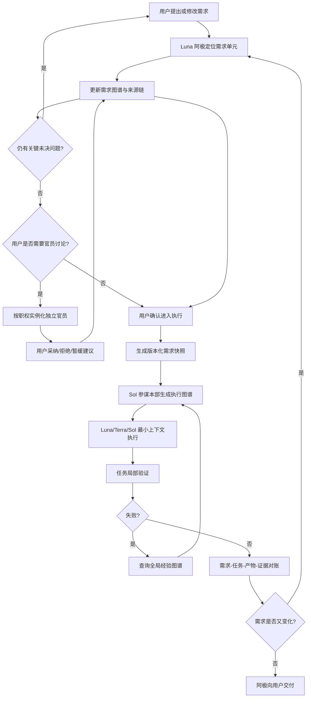

# 无极军团 3.0 完整方案

> 状态：目标架构草案（基于已确认讨论整理）<br>
> 范围：只定义 3.0 应当是什么，不评价或对比当前无极军团的实现。
>
> 图谱体系的完整定义见 [无极军团 3.0 全图谱架构](wuji-legion-3.0-graph-architecture.md)。该文档是本方案关于图谱种类、所有权、跨图边界和官员图谱的规范性补充；需求图谱与执行图谱只是其中两张核心权威图。
>
> 进化主帅关于新物种融合、来源谱系、规则与资产双轨继承、拒绝记录和版本更新的规则见 [进化主帅与能力谱系融合](wuji-legion-3.0-evolution-commander.md)。

## 1. 总体定义

无极军团 3.0 是一个以用户决定为最高权威、以双图谱驱动、以最小上下文执行的多模型协作系统。

它不依赖把完整聊天记录、完整项目背景和完整父任务上下文反复交给模型，而是把长期交流形成结构化状态，再按当前任务动态投影最小必要上下文。

默认组织结构：

```text
用户
  <-> Luna 阿极：多轮交流、澄清需求、维护需求图谱
        -> 需求图谱快照
  <-> Sol 参谋本部：维护执行图谱、拆分、调度决策、跟进、重规划
        -> Luna / Terra / Sol 子代理：执行最小任务
        -> 验证证据
  <- 阿极：向用户交付结果并继续接收修改
```

核心权责：

- 用户拥有最终决定权，包括需求、方案、风险取舍和是否采纳官员意见。
- 阿极是唯一用户接口，也是需求图谱的唯一正式写入者。
- 参谋本部是执行图谱的唯一正式写入者，不能修改用户需求事实。
- 子代理只执行被分配的任务，不拥有全局路由权和完成裁决权。
- 独立官员只有建议权，不拥有写权、派发权、否决权或完成裁决权。
- 每个产物或图谱单元在同一版本中只能有一个明确写入者。

## 2. 为什么采用阿极与参谋本部分离

3.0 采用“阿极和主路由分离”的结构：

- 阿极负责可能持续很多轮、甚至跨越数天的需求发现过程。
- 参谋本部只从结构化需求快照开始，不继承此前几十轮聊天。
- 阿极优化沟通速度、需求忠实度和长期状态维护。
- 参谋本部优化任务拆解、依赖关系、模型选择、执行跟踪和验收闭环。

这不是两个互相竞争的路由器：

- 阿极只路由对话所需的需求单元和必要咨询。
- 参谋本部只路由已经形成的执行任务。
- 二者以版本化需求快照作为明确边界。

不设置强制“冻结计划书”环节。交接对象是一个可追溯、可继续演化的版本快照，而不是永久冻结的文档。用户后续改变需求时，阿极产生新版本；参谋本部只使受影响的执行节点失效并重新规划。

## 3. 模型默认分工

### 3.1 Luna 阿极

主要职责：

- 与用户进行快速、多轮、自然的需求交流；
- 识别用户尚未明确表达的目标、约束、偏好和拒绝项；
- 定位当前正在修改的需求单元；
- 把已解决的对话状态提交到需求图谱；
- 维护未决问题、冲突和用户决定；
- 在用户要求总结或准备执行时生成需求图谱快照；
- 将参谋本部的方案、执行状态和最终结果转达给用户。

阿极遇到超出自身把握的专业问题时，可以请求一个有边界的 Terra 或 Sol 咨询任务，但咨询代理不直接接管用户对话，也不能修改需求图谱。

### 3.2 Sol 参谋本部

主要职责：

- 接收需求图谱快照并检查可执行性；
- 建立独立的执行图谱；
- 拆分任务、识别依赖、决定并行与顺序；
- 为任务选择 Luna、Terra 或 Sol；
- 为每个子代理生成最小上下文投影；
- 收集结果、验证证据、处理失败、重试与升级；
- 在需求变化时局部失效和重建执行节点；
- 最终完成需求图谱与执行图谱的逐项对账。

参谋本部主要做调度和判断，困难的架构、推理或审查任务应派给 Sol 子代理，不要求参谋本部亲自完成所有高难度工作。

### 3.3 三类子代理

| 模型 | 默认任务 |
|---|---|
| Luna | 机械操作、提取、格式转换、明确目标的有限检索、重复性验证 |
| Terra | 需要正常理解、判断和实现能力的多数任务 |
| Sol | 架构设计、复杂推理、高风险判断、困难根因分析和高要求审查 |

模型难度不在用户第一次提出需求时判断。需求可能在多轮讨论中从小任务演化成大任务。模型选择发生在参谋本部形成具体执行节点之后，并可在出现新证据或失败时重新评估。

## 4. 需求图谱

### 4.1 定义

需求图谱是一张动态、分层、可版本化的表格。它回答的是“用户真正要什么”，而不是“系统准备怎么做”。

表格结构不是固定模板：单元可以新增、拆分、合并、重命名、废弃、替代或建立依赖。大单元应在内容增长时继续拆成小单元，避免任何一个单元重新变成巨大上下文。

### 4.2 单元内容

每个需求单元至少记录：

- 稳定单元 ID 和当前修订 ID；
- 目标和预期结果；
- 用户明确想要的内容；
- 用户明确不要的内容；
- 约束、偏好和优先级；
- 验收标准；
- 已确认决定；
- 未决问题和冲突；
- 依赖或影响的其他单元；
- 来源消息 ID、修改链和证据指针；
- 状态：草拟、待确认、已确认、被替代或废弃。

“不要什么”原则上记录在受影响的具体单元中，而不是堆成一个无限膨胀的全局禁止清单。只有确实作用于整个项目的目标、身份、安全边界和硬约束，才进入精简的全局约束区。

### 4.3 聊天记录与图谱的关系

- 原始用户和助手消息可以不可变保存，用于追溯和争议复查。
- 原始聊天默认绝不进入活跃上下文。
- 每次图谱修改都保存来源消息 ID、前后修订 ID 和变更关系。
- 哈希可以用于完整性校验，但稳定 ID、版本链和双向索引才是主要定位方式。
- 系统应能从任意图谱单元定位相关消息，也能从任意消息定位它影响过的图谱单元。
- 只有摘要不足、来源冲突或用户明确要求时，才回读局部原始消息；极少需要扫描完整聊天。

### 4.4 阿极每轮的上下文

默认上下文由以下部分动态重建：

```text
动态空表格骨架
+ 当前活跃单元
+ 当前单元必要的依赖片段
+ 尚未提交的对话状态
+ 相关 ID、版本和来源指针
+ 当前用户消息
```

已经提交到图谱的对话不再作为聊天上下文保留。系统不机械保留“最近 N 条消息”；只保留尚未解决、尚未写入状态的最小对话片段。

用户切换到另一个单元时，隐藏原单元内容，只加载新单元及必要依赖。用户要求整体总结或准备执行时，才生成完整但结构化的需求快照。

这种设计不能保证任何极端任务永远不触及上下文上限，但它使上下文规模主要取决于当前单元，而不是累计聊天轮数。

### 4.5 同窗虚拟新窗口

3.0 的原生宿主（包括未来 Pi 改造）必须把**用户可见聊天记录**与**某次模型调用的推理上下文**分离。用户可以始终停留在同一聊天窗口，查看完整、可追溯的历史；阿极在每个检查点把已确认状态写入图谱后，下一次推理只重建：动态骨架、当前单元、必要依赖、版本指针与当前消息。

这相当于在同一窗口内开启新的逻辑上下文，而不是压缩或回放完整聊天。原始聊天只作为冷证据，按单元和消息 ID 局部回读。

当前 Codex 2.1 无法通过 Skill 强制移除主线程已发送历史，因此只能做到部分实现：将图谱最小投影交给新的子代理/执行会话，使真正执行的分支获得新上下文；主窗口只能逻辑上优先使用图谱，不能保证物理清空。不得把这种近似实现宣称为原生同窗重置。

## 5. 从需求图谱到执行图谱

阿极向参谋本部交付的是一个内容寻址、版本化的需求快照，至少包含：

- 快照 ID 和生成时间；
- 有效需求单元及修订号；
- 全局硬约束；
- 单元间依赖和冲突；
- 验收标准；
- 尚未解决但允许进入执行的问题；
- 用户对官员建议的采纳、拒绝或暂缓状态。

参谋本部不需要审查此前全部聊天。若快照存在无法执行的歧义，参谋本部提出精确问题，由阿极返回对应需求单元与用户继续交流。

## 6. 执行图谱

### 6.1 定义

执行图谱是参谋本部根据需求快照创建的另一张动态图谱。它回答“为了交付这些需求，需要做什么、由谁做、按照什么依赖和证据完成”。

需求图谱和执行图谱必须分开：参谋本部可以重写执行方案，但不能把执行便利篡改成用户需求。

### 6.2 执行节点

每个执行节点至少包含：

- 任务 ID 和版本；
- 引用的需求单元及精确修订号；
- 任务目标和明确排除项；
- 输入句柄和允许读取的上下文；
- 预期产物和输出结构；
- 依赖节点；
- 负责模型和选择理由；
- 验收条件；
- 验证方法和证据要求；
- 时间、成本、重试、分支和联网边界；
- 写入范围和冲突规则；
- 状态、失败信息和恢复记录；
- 产物、验证证据和最终对账关系。

执行图谱不是固定的“一个需求行对应一个任务列”。参谋本部可以把一个需求拆成多个任务，也可以让一个任务覆盖多个紧密相关的需求。关键是每个关系均有显式 ID 和可追溯映射。

### 6.3 子代理上下文投影

子代理只获得完成节点所需的最小交叉投影：

| 任务类型 | 默认上下文 |
|---|---|
| 机械任务 | 操作指令、输入句柄、输出格式、验收、失败回报方式 |
| 普通任务 | 机械任务内容，加局部目标、相关约束、必要依赖和接口契约 |
| 高推理任务 | 相关需求子树、关键冲突、架构边界、证据和决策要求 |

Sol 也不默认获得完整聊天。只有任务本身需要全局架构判断时，才可以读取完整需求快照或执行图谱；即使如此，原始聊天仍不默认加载。

子代理上下文必须带有来源和版本，不能把复制出来的文字当成无来源事实。子代理返回产物、证据、假设、未完成项和失败信息，不能直接宣布整个项目完成。

## 7. 执行与重规划

- 没有依赖关系的执行节点可以并发。
- 存在输入输出依赖的节点必须顺序执行。
- 同一可写对象同时只能有一个写入者；其他代理使用只读副本或隔离工作区。
- 失败时先查询全局经验图谱，再决定复用方案、有限研究、重试、升级模型或请求用户。
- 子代理结果不满足验收时，只重做受影响节点，不全局返工。
- 用户修改需求时，阿极生成新需求修订和新快照。
- 参谋本部依据精确引用关系，使受影响节点及其下游失效；无关节点和有效证据继续保留。

## 8. 执行边界和循环控制

执行边界是参谋本部和确定性运行时共同维护的系统能力，不由合规官动态指挥。

每个任务必须具有与风险相称的边界：

- 整体和节点最长运行时间；
- Token 或费用预算；
- 最大重试次数；
- 最大并发和分支数量；
- 最大联网来源、下载量或外部调用数；
- 最大执行图谱修订次数；
- 连续无进展次数；
- 停止、升级和请求用户确认的条件。

循环指纹可以由以下元素构成：

```text
执行节点 + 输入版本 + 错误指纹 + 恢复动作
```

如果循环指纹重复，且没有新增证据、产物哈希变化、需求变化或执行状态推进，则计为无进展循环。达到边界后必须停止、换方案、升级或请求用户，不能无限重试。

### 8.1 三级失败熔断

不能只按“同一个命令”判断重复，因为代理可能改变命令写法，却仍在重复同一种失败方法；也不能只按“同一个任务”判断，因为同一任务可能合理地尝试不同方案。系统应建立“执行尝试指纹”：

```text
任务节点 ID
+ 操作意图
+ 规范化命令或工具调用
+ 输入和关键状态版本
+ 执行环境
+ 策略 ID
+ 错误指纹
```

默认实行三级熔断，具体阈值可以由用户或任务风险覆盖：

1. **重复尝试熔断**：完全相同的执行尝试失败后，只有存在瞬时故障证据时才允许再试一次；第二次相同失败立即熔断。确定性错误不得无变化盲目重试。
2. **重复策略熔断**：同一解决策略连续失败两次，必须放弃该策略并明确说明下一种方法与前一种有什么实质变化。只修改命令语法、提示词措辞或重启同一流程，不算新策略。
3. **任务级熔断**：默认尝试三种实质不同的策略，或者累计五次失败仍没有进展时，将节点标记为失败或阻塞，停止自动消耗，并向用户报告。不能为了“继续努力”自行开启新一轮无限尝试。

“有进展”必须至少满足一项：获得新的可信证据、改变关键输入或环境、产生新的有效产物、错误指纹发生有意义变化、需求或执行图谱得到有效修订。单纯消耗时间、Token 或换一种说法不算进展。

触发熔断后，系统只能选择以下动作：

- 查询或重新核验全局经验图谱；
- 采用有明确差异的新策略；
- 对非小问题进行有边界的外部调查；
- 升级到更适合的模型或根因能力；
- 保存当前证据并请求用户决定；
- 明确宣布该节点暂时失败或阻塞。

涉及付款、发布、删除、权限修改等可能产生副作用的操作，除非有幂等证明、状态确认和安全恢复方案，否则默认不自动重试。

持续运行目标采用租约式执行：每个周期有预算、检查点、进展判定和续期条件。持续目标可以长期存在，但任何一次执行周期都必须有界。

## 9. 全局失败与复用经验图谱

### 9.1 定位与所有权

经验图谱是所有项目共享的全局图谱，只记录失败和可复用经验，不保存项目完整历史。

- 运行时在失败、能力缺失或明确复用时查询它。
- 根因能力负责产生候选根因、证据、置信度和适用范围。
- 进化主帅负责来源判定、拒绝记录、去重、规则与资产融合、谱系更新、代际复验、降级、过期和退役；它不把来源项目机械准入为默认能力。
- 图谱治理者不能在没有证据时自行创造根因；根因分析者也不能自行把结论晋升为全局真理。

### 9.2 检索与恢复流程

```text
失败发生
→ 规范化错误指纹
→ 查询全局目录
→ 读取少量匹配单元
→ 校验范围、版本、证据、TTL和失效条件
→ 命中有效方案：应用并做任务本地验证
→ 未命中：小问题直接解决；非小问题优先有限联网研究
→ 写入候选事件
→ 经独立验证或重复成功后晋升为可复用方案
```

第一次失败就写入轻量候选事件，以便统计重复；但第一次结论不能未经验证直接成为全局可信方案。

非小问题的外部调查默认按“官方资料 -> 官方或可信代码仓库 -> 可靠社区证据”推进，并设置来源、时间和结果数量边界。

### 9.3 经验单元

经验单元至少包含：

- 经验 ID、类型和状态；
- 规范化错误或复用指纹；
- 工具、服务、接口、操作、版本和环境范围；
- 症状与触发条件；
- 根因及置信度；
- 已失败方法；
- 成功恢复方案的位置指针；
- 验证产物与哈希；
- 出现次数、涉及项目数和成功复用次数；
- 创建、最后命中和最后复验时间；
- TTL、失效条件和替代关系；
- 安全分级和脱敏状态。

目录只保存用于定位的键和短摘要；具体单元保存紧凑结论和证据指针。原始聊天、密钥、完整日志和大段解决方案正文不得进入经验图谱。

## 10. 独立官员框架

### 10.1 一个框架，按需实例化

3.0 不维护常驻官员委员会，而是维护统一的“综合独立官员框架”和一组职权模板。

- 默认不启动真实官员；由各官员的低成本触发契约按任务类型、阶段、产物、风险、错误、性能或证据缺口选择相关职权，再由主模型执行局部检查。
- 只需要一种独立意见时，启动一个实例并只挂载该职权；例如只挂载白帽，它就等同于独立白帽。
- 需要多个检查维度且强调速度时，一个独立实例可以挂载多个职权。
- 需要真正群策群力时，由阿极并发启动多个相互隔离的官员实例；综合官本身不获得二级路由权。
- 主模型模拟不能宣称为真实独立审查。

### 10.2 独立讨论协议

多个官员参与讨论时：

1. 每个官员获得相同的事实快照、自己的职权模板、相关图谱单元和当前用户问题。
2. 首轮不能看到其他官员的结论，防止迎合和串场。
3. 每个官员以独立 ID 发言，阿极不得在用户看见前把分歧抹平成一个结论。
4. 用户单独追问某官员时，只恢复该官员自身历史和必要图谱单元。
5. 只有用户要求辩论或交叉质询时，才把其他官员的指定意见作为有来源的输入提供。
6. 官员始终只有建议权；用户决定采纳、拒绝、暂缓或修改后采纳。
7. 阿极只把用户采纳的结论写入正式需求图谱。
8. 参谋本部只执行用户确认后的需求，不得复活被拒绝的官员意见。

建议记录至少包含：建议 ID、官员 ID、职权、内容、证据、因果线、用户决定、决定来源消息和受影响需求单元。

### 10.3 职权边界与因果线扩散

官员不能串场，但可以沿因果线扩散发现：

- 向上追溯：现象 -> 直接原因 -> 根本原因；
- 向下推演：当前问题 -> 后续影响 -> 次生风险；
- 横向传播：一个图谱单元变化 -> 其他受影响单元。

规则是：

- 本职范围内可以给出正式专业意见；
- 跨领域可以指出因果关系和风险，但必须标记为待对应职权复核；
- 官员不能自行调用其他官员，只能建议用户或阿极转交；
- 因果线逐层展开，不设置僵硬的一跳限制；
- 当证据明显变弱、与用户目标无关或已无可执行影响时停止；
- 新官员必须独立验证上一官员的跨域推测，不能直接继承为事实。

因果节点记录：因果线 ID、父子节点、关系类型、证据、置信度、提出官员、专业归属、待复核状态、用户决定和受影响图谱单元。

## 11. 官员与系统能力的边界

| 名称 | 独立实例的职责 | 默认实现 |
|---|---|---|
| 白帽 | 从用户利益出发找反例、风险、错误假设和遗漏 | 主模型内部反方检查 |
| 质检 | 检查产物是否正确、可用并满足需求 | 自动测试 + 主模型判断 |
| 审计 | 检查授权、过程、来源、版本、证据链和完成声明 | 确定性证据映射 + 主模型判断 |
| 保卫科 | 审查外部访问、供应链、凭据和高危操作 | 硬安全门禁 + 按需专家 |
| 合规 | 审查授权、许可证、隐私、数据使用和发布义务 | 规则检查 + 按需专家 |
| 根因 | 对未知或反复失败形成根因候选 | 失败触发的冷专家 |
| 性能基准 | 解释速度、成本、质量和回退证据 | 遥测、标准化探针 + 按需专家 |
| 综合验收审计 | 在一次独立调用中组合多个复核维度 | 高风险或用户要求时启动 |

质检和审计不是简单的“之前与之后”：

- 质检关注产物本身是否正确和可用。
- 审计关注过程、授权、溯源和完成声明是否有证据。

综合官可以把二者合并在一次调用中，但必须保留两个独立栏目，避免用“测试通过”代替授权和证据审计，或用“流程合规”代替产物质量。

除保卫科外，官员采用按职责的 MoE：每个官员只定义自己的触发契约，例如质检关注产物与验收缺口，审计关注来源、授权和证据链缺口，合规关注许可证、数据和发布动作，根因关注未知或重复失败，性能关注可观测回退。触发只激活相关职权的主模型检查；只有需要真实独立性、触及该职权的高风险条件或用户明确要求时，才创建一个真实独立实例。官员不能互相触发或扩散成默认委员会。

保卫科例外：保卫科模型默认休眠，不轮询、不保留上下文、不消耗 Token。对联网、外部下载、Skill/MCP/代码引入、命令执行、文件写入、账号/密钥、权限提升、发布、付款和删除等动作，才在动作前触发一次极小的确定性防护门禁，可自动限制或阻断；没有这类动作就没有保卫科工作。只有规则无法判定的安全问题才按需激活保卫科实例。

## 12. 白帽的特殊地位

白帽在命令链之外，只服务于用户：

- 讨论阶段可以持续提出意见，直到用户确认执行方案；
- 阿极和参谋本部听从用户，而不是听从白帽；
- 用户采纳后，阿极才更新需求图谱；
- 用户确认方案后，白帽退出；
- 只有用户再次邀请，白帽才重新出现；
- 默认只读取需求总表、执行方案、二者差异和当前争议点；
- 除非用户要求，白帽不搜索完整聊天、文件或网络。

用户未要求真实白帽时，主模型可以做内部白帽检查，但必须清楚标注它不是独立证据。

## 13. 安全、账号与密钥

保卫科的核心防护必须落实为确定性系统能力，而不是依赖模型记忆：

- 联网前检查目标域名、出站数据和授权范围；
- 检测网页提示注入、恶意下载和可疑执行指令；
- 引入 Skill、MCP 或外部代码前检查入口、脚本、依赖、权限、网络、文件访问和供应链风险；
- 密钥不得写入规则、仓库、图谱、普通日志和产物；
- 使用密钥管理器、受控环境变量或不经过模型上下文的秘密输入通道；
- 对外部写入、发布、付款、删除和权限提升设置硬门禁。

如果用户已经在聊天中输入 Key：

1. 不复述、不继续传播；
2. 停止把它传给其他模型、工具、日志和文件；
3. 清理可控的本地副本和派生产物；
4. 撤销或轮换旧 Key；
5. 用最小权限的新 Key 通过安全通道配置；
6. 记录不包含秘密本身的安全事件。

事后加密只能保护后续存储，不能保证删除已经进入聊天上下文、服务日志或外部提供商系统的内容，因此不能以“已加密”代替轮换。

外部能力引入采用分工：保卫科审安全，合规能力审许可证和数据义务，进化主帅审融合价值、规则与资产继承、统一调用链、谱系更新和退役。只有用户确认融合提案后，来源材料才可进入融合物种。

## 14. 性能与成本治理

性能基准不作为常驻官员，而是进化治理下的遥测和标准化探针。它在以下情况运行：

- 新模型、Skill、MCP 或路由策略准备晋升；
- 发现速度、成本、成功率或质量回退；
- 用户明确要求比较；
- 重大供应商或模型路线选择。

普通指标由系统直接记录，不需要模型：延迟、失败率、重试、上下文大小、Token、费用、缓存命中、验证通过率和返工率。需要解释原因、权衡质量或设计新基准时，才调用模型。

## 15. 最终验收

最终验收不是“所有执行节点显示完成”，而是参谋本部把最终有效需求图谱与完成后的执行图谱逐项对应：

```text
需求单元及修订
  -> 执行任务
  -> 产物
  -> 验证方法
  -> 验证证据
  -> 验收结果
```

最终目标是最初需求快照加上执行期间所有用户批准的变化。被替代或撤销的旧需求不再验收，但必须保留版本关系。

每个任务先做局部验证，避免错误产物继续向下游传播；最终图谱对账是权威验收。高风险任务或用户明确要求时，可以启动一个独立综合验收审计实例；普通任务由确定性验证和主模型检查完成。

独立审查失败本身不赋予官员否决权，但阿极不能在必需证据缺失或硬门禁失败时虚假声明完成。最终向用户展示通过项、未通过项、风险和可选择的处理方式。

## 16. 完整生命周期



## 17. 默认速度策略

```text
普通任务
→ 不启动独立官员
→ 主模型做相关职权的内部检查
→ 确定性验证
→ 直接交付

重要但非极端高风险任务
→ 一个综合独立实例挂载多个必要职权
→ 与可并行的最终验证同时运行
→ 阿极汇总给用户决定

真正需要群策群力
→ 多个官员实例并发首轮盲审
→ 分别向用户发言
→ 用户决定采纳内容

专业高风险事件
→ 硬门禁先阻断
→ 只增加被触发领域的专业实例
```

默认真实官员调用数为 0；需要一般独立性时为 1；只有用户明确要求群策群力或出现专业高风险事件时才超过 1。

## 18. 明确不采用的做法

- 不在第一次交流时预判整个任务最终难度。
- 不把完整聊天记录当作长期上下文。
- 不保留固定最近 N 条已解决消息。
- 不让所有子代理继承父任务全文。
- 不把需求图谱和执行图谱混成一张表。
- 不要求一行需求必须对应一列任务。
- 不设置额外模型对需求快照做形式化冻结审查。
- 不让白帽或综合官成为第二路由器。
- 不默认启动常驻官员委员会。
- 不把同一主模型的角色模拟称为真实独立审查。
- 不让全局经验图谱进入每个普通任务的热路径。
- 不把密钥、完整日志、完整聊天或大段方案正文写入全局图谱。
- 不以“任务节点全部完成”代替最终需求对账。

## 19. 3.0 架构验收标准

3.0 的实现至少应通过以下行为测试：

1. 经过数十轮讨论后，阿极仍能只加载当前需求单元继续准确修改。
2. 任意需求单元能定位到产生和修改它的原始消息，任意消息也能反查影响单元。
3. 用户切换需求单元时，不需要回放其他单元的完整交流。
4. 参谋本部只读取需求快照即可建立执行图谱，不需要读取此前全部聊天。
5. 用户修改一个需求后，只有相关执行节点和下游节点失效。
6. 机械任务只收到操作、输入、输出、验收和失败回报所需内容。
7. 子代理无法自行修改需求事实、扩大任务范围或宣布全局完成。
8. 重复失败能先命中目录、再命中经验单元，并验证方案是否仍适用。
9. 错误经验能够被降级、替换、过期和退役，不会永久污染所有项目。
10. 默认任务不调用真实官员；单官职和多官职综合审查均能按需运行。
11. 多官员首轮能够隔离发言，并保留分歧、职权和因果线来源。
12. 只有用户采纳的官员建议进入正式需求图谱和后续执行。
13. 密钥不会进入普通日志、仓库和图谱；已经暴露的密钥触发清理与轮换流程。
14. 无进展循环、无限重试和失控持续目标能够被确定性边界终止。
15. 最终交付能展示完整的“需求 -> 任务 -> 产物 -> 验证证据”对应关系。
16. 完全相同的执行尝试不会在无瞬时故障证据时重复运行；同一策略和同一任务达到阈值后能够自动熔断并停止 Token 消耗。
17. 同类来源融合后，运行时调用的是可解释的新规则或工作流，而不是多个父代规则的机械叠加或轮流调用。
18. 被计入融合成果的模板、组件、脚本和配置均具有来源版本与稳定 ID，并能由融合 Skill 的统一入口检索、选择和真实调用；不兼容组合不会被强行执行。
19. 同一来源版本再次提交时可直接返回已记录结论；来源新版本能沿谱系定位受影响规则、资产和融合物种，并提出新一代而不覆盖旧代。
20. 被拒绝或未采用的来源只保留最小判定记录，不保留完整项目、模板、组件或脚本资产。

## 20. 最终定案

无极军团 3.0 的核心不是代理数量，而是五个相互衔接的机制：

1. Luna 阿极通过局部需求图谱承载长期、多轮、渐进式需求发现。
2. Sol 参谋本部从版本化需求快照开始，以独立执行图谱完成拆解和调度决策，实际派发由宿主完成。
3. Luna、Terra、Sol 子代理只获得任务所需的最小动态投影。
4. 用户通过按需实例化、可沿因果线扩展但无执行权的独立官员获得第三方意见。
5. 最终由确定性证据校验器对需求、任务、产物和验证证据进行图谱对账；阿极与参谋本部都不自行验收，并把验证过的失败经验沉淀到受治理的全局图谱。
6. 进化主帅将有价值的外部来源融合为可调用、可溯源、可继续演化的新能力物种；不适合的来源明确拒绝并只留最小版本判定记录。

其目标是同时获得：长期交流不失真、上下文增长受控、任务路由准确、执行速度可控、错误可以复用、所有决定和产物均可溯源。
