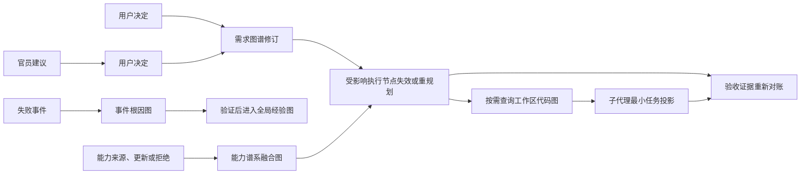

# 无极军团 3.0 全图谱架构

> 状态：目标架构草案（基于已确认讨论、白帽审查及图谱项目调研整理）<br>
> 与 [无极军团 3.0 完整方案](wuji-legion-3.0-blueprint.md) 配套使用。<br>
> 本文不评价现有 2.0 实现，也不把任何外部项目直接视为已融合能力。

## 1. 总体决定

无极军团 3.0 不只有阿极的需求图谱和参谋本部的执行图谱。它是一套由不同权威主体维护的专用图谱体系。

设计原则是：

```text
少量长期权威图谱
+ 主帅专职运行图谱
+ 官员按审查实例创建的隔离观点图
+ 一个极小的谱系索引
≠ 一张自动吸收所有内容的万能总图
```

每张图谱只回答一个确定问题。跨图只能建立版本化引用，不能跨图改写真相。图谱的目标是减少上下文、提高溯源和局部重规划能力，不是积累尽可能多的信息。

## 2. 统一图谱契约

所有图谱使用相同的外层记录约束，但不强迫不同领域使用相同业务列。

```text
graph_id                 图谱类型、范围和实例
owner                    唯一正式写入者
unit_id / revision_id    稳定单元和不可混淆的修订
authority                确认、观测、验证、推测、建议或失效
status                   当前生命周期状态
valid_from / valid_to    当前修订的有效时间窗口
evidence_handles         内容寻址的来源、产物、测试或消息指针
relations                受限谓词的跨图或图内关系
classification           公开、项目、受限、秘密引用等访问级别
retention / TTL          保留、复验、归档和清理规则
record_hash              记录完整性校验
```

建议统一使用以下证据等级：

| 等级 | 含义 | 能否直接成为正式事实 |
|---|---|---|
| `user-confirmed` | 用户明确确认 | 可以 |
| `deterministic-observed` | 工具、测试或运行时直接观测 | 可以作为工程事实 |
| `externally-verified` | 有范围和时效的外部证据 | 可以作为参考事实 |
| `model-derived` | 模型结构化归纳或推断 | 不可以，需确认或验证 |
| `officer-advisory` | 独立官员建议 | 不可以，需用户采纳 |
| `invalidated` | 被新修订、证据或失效条件取代 | 不可以 |

Graphify 的 `EXTRACTED / INFERRED / AMBIGUOUS` 思想应吸收为这一证据等级的一部分：文件明确关系、系统推断关系和待确认关系绝不混写。

## 3. 查询、上下文与谱系索引

每张图谱都遵循阿极已经确定的查询方式：

```text
查询目的
→ 查图谱目录与范围
→ 定位一个或少量单元
→ 读取当前修订、必要依赖和证据句柄
→ 必要时沿明确因果线逐层扩展
→ 到达相关性、证据、字节或时间边界即停止
```

任何模型的上下文都不是“整张图”，而是：

```text
该图的动态骨架
+ 当前单元
+ 必要依赖片段
+ 版本与权限指针
+ 当前任务或用户消息
```

建立一个确定性的**谱系索引**，但它不是总图，也不保存业务正文：

```text
对象 ID → 所属图谱 → 当前修订 → 来源句柄 → 允许读取者 → 相关对象 ID
```

谱系索引只负责定位、版本跳转、权限和过期检查。它不能做全局语义推理，不能成为第二路由器。

## 4. 长期权威图谱

### 4.1 阿极图谱组

| 图谱 | 所有者 | 回答的问题 | 核心单元 | 不承担的职责 |
|---|---|---|---|---|
| 需求图谱 | Luna 阿极 | 用户真正要什么 | 目标、想要/不要、约束、验收、未决项、依赖 | 实现方案和模型调度 |
| 决策图谱 | Luna 阿极 | 用户到底采纳或拒绝了什么 | 决策、备选、用户消息、受影响需求修订 | 代替用户作决定 |
| 对话证据索引 | Luna 阿极 | 某个需求单元为何这样写 | 原始消息句柄、摘要、图谱修订链接 | 作为日常上下文或自动记忆 |

原始聊天是不可变证据，不是活跃记忆。对话证据索引默认只按单元或消息 ID 回读局部来源；它不提供全文上下文回放。

### 4.2 参谋本部图谱组

| 图谱 | 所有者 | 回答的问题 | 核心单元 | 不承担的职责 |
|---|---|---|---|---|
| 执行图谱 | Sol 参谋本部 | 如何完成已确认需求 | 任务、依赖、模型、上下文投影、预算、产物、状态 | 改写用户需求、实际派发或执行任务 |
| 验收证据图谱 | 确定性证据校验器 | 是否已经真正交付 | `需求 → 任务 → 产物 → 验证` 映射、缺口、结果 | 让阿极或参谋本部脱离证据自行验收 |
| 任务尝试账本 | 确定性执行器 | 是否陷入重复尝试或循环 | 尝试指纹、策略、错误、进展、熔断状态 | 让模型自行决定无限重试 |

执行图谱是独立于需求图谱的动态图。每个执行节点引用精确的需求修订；用户需求变化时，只使引用该修订及下游依赖的节点失效。验收证据图谱是最终对账视图，不允许重新定义需求。

### 4.3 工程与研究图谱组

| 图谱 | 所有者 | 范围 | 核心单元 | 生命周期 |
|---|---|---|---|---|
| 工作区代码图 | 工程能力服务 | 项目/工作区 | 文件、符号、调用、导入、测试、配置、变更影响 | 可重建、可丢弃 |
| 研究证据图 | 研究能力服务 | 任务或资料库 | 来源、声明、反证、日期、适用范围、提取片段 | 任务结束后冷存档，按 TTL 复验 |
| 事件根因图 | 根因能力 | 单次失败或事件 | 症状、假设、实验、反证、根因、恢复、回归验证 | 事件关闭后归档 |

工作区代码图只陈述代码事实和结构关系。它不能把代码结构推断成用户意图。研究证据图只保留经过边界检查的来源和声明，不把网页全文塞入图谱或上下文。

根因图中的结论是候选因果关系。只有被验证、去重、限定范围并设定失效条件后，才可能进入全局经验图谱。

### 4.4 进化与跨项目图谱组

| 图谱 | 所有者 | 范围 | 核心单元 | 晋升门槛 |
|---|---|---|---|---|
| 全局经验图谱 | 进化主帅 | 跨项目 | 错误指纹、范围、根因、恢复、验证、TTL、替代 | 已验证或重复成功，不是第一次猜测 |
| 能力谱系融合图 | 进化主帅 | 跨项目 | 来源、版本、采用/拒绝记录、原子规则与资产、融合物种、代际、统一入口、兼容关系 | 只保留有新组合价值且可真实调用的融合物种 |
| 性能证据图谱 | 性能能力 | 跨项目聚合与项目明细 | 工作负载、模型/能力路线、延迟、成本、成功率、质量、基线 | 足够样本和可复现实验 |

能力谱系融合图是插件、MCP、Skill 来源与融合物种的事实来源。它不以“收集多少项目”为目标：未采用来源只留下最小判定记录；已采用来源必须能说明其规则、模板、组件、脚本和配置如何通过融合物种的统一入口被调用。它记录来源版本、谱系、适用范围、许可、入口、兼容关系、更新影响与拒绝理由；它不直接派发任务。

性能图谱不根据一次测试替换主路线。成本、Token、缓存、实际模型等提供商遥测如果不可见，必须记录为不可用，不能伪造。

### 4.5 安全与合规图谱组

| 图谱 | 所有者 | 核心单元 | 禁止保存 |
|---|---|---|---|
| 安全信任图谱 | 保卫科能力 | 资产、权限、数据流、外部来源、依赖、控制、暴露、缓解措施 | Key 明文、完整提示、完整聊天、密码 |
| 合规义务图谱 | 合规能力 | 规则、适用范围、授权、数据类型、许可证、地域、保留期、义务、豁免 | 不必要的个人数据和秘密 |

安全和合规图谱可以提出风险、阻断条件和处理回执，但不能管理时间、Token、重试或模型路由。执行边界仍属于执行图谱和确定性执行器。保卫科模型默认休眠；只在受控外部动作发生前触发一次极小的确定性防护门禁，可自动限制或阻断，不轮询、不保留上下文、也不产生模型 Token 消耗。

秘密只用不透明引用记录：秘密类型、来源范围、访问者、轮换状态、泄露处置和到期时间。任何图谱都不得保存秘密值。

## 5. 主帅与官员的专属图谱

每个主帅或独立官员都可以有自己的图谱，但其含义是**职责隔离的工作图或观点图**，不是复制一份项目总图。

### 5.1 主帅图谱

| 主体 | 专属图谱 | 写入权限 |
|---|---|---|
| 阿极 | 需求、决策、对话证据索引 | 正式写入需求与用户决定 |
| 参谋本部 | 执行、验收、任务尝试账本 | 正式写入执行状态与验收映射 |
| 进化主帅 | 能力谱系融合、全局经验、性能聚合 | 判定、拒绝、融合、继承、更新与退役；不接管任务路由 |

### 5.2 官员观点图模板

每次真实独立审查创建一个隔离的 `review-session` 图。它只读取被允许的投影，首轮不读取其他官员意见。结论被用户采纳前只能是建议。

| 官员 | 自己图中的节点 | 可沿因果线扩展到 | 正式结论边界 |
|---|---|---|---|
| 白帽 | 假设、反例、风险、备选、建议 | 需求、执行、受影响官员 | 只给用户建议 |
| 质检 | 用户可见要求、检查、缺陷、复测 | 验收证据、代码测试 | 质量是否满足要求 |
| 审计 | 声明、版本、授权、来源、证据缺口 | 验收、合规、执行记录 | 证据链是否闭合 |
| 保卫科 | 威胁、攻击面、信任边界、控制、缓解 | 安全信任、合规、执行 | 安全风险和处置建议 |
| 合规 | 规则、义务、授权、豁免、风险 | 合规义务、决策、发布节点 | 合规建议和必要授权 |
| 根因官 | 症状、假设、实验、根因、恢复 | 事件根因、经验、代码图 | 根因候选和验证建议 |
| 性能官 | 工作负载、测量、基线、回退 | 性能、能力、执行图 | 性能解释和比较建议 |
| 综合官 | 本次启用职权的分隔子图 | 只到用户许可的图谱 | 汇总意见，不融合成第二路由 |

官员可以沿因果线发现跨域影响，但跨出职责边界后必须标为“待对应职权复核”。官员不能自行调用其他官员，不能派发子代理，不能修改需求或执行图谱。

### 5.3 白帽图谱

白帽图谱的最小结构为：

```text
事实快照
→ 假设
→ 反例或风险
→ 因果链
→ 备选方案
→ 建议
→ 证据与置信度
→ 用户采纳 / 拒绝 / 暂缓
```

白帽默认只读取需求总表快照、执行方案、版本差异、当前待决问题和已获许可的结论。用户确认方案后，白帽图谱退出热路径并冷存档；被采纳建议由阿极转写为正式需求或约束，而不是由白帽直接写入。

## 6. 子代理为什么通常不需要独立图谱

每个子代理不应建立长期项目图谱。否则代理数量会直接变成图谱数量，造成副本冲突、上下文膨胀和无止境同步。

子代理默认获得：

```text
执行节点最小投影
+ 相关代码/研究/安全单元的句柄
+ 输入、输出、验收和失败回报格式
```

子代理只产生任务回执：产物句柄、证据、假设、失败、尝试指纹和测量值。只有多步骤根因调查、专项研究或真实官员审查，才创建短寿命的事件图或观点图。

## 7. 跨图关系与失效传播

允许的关系谓词应固定且可审计，例如：

```text
derives-from       来源于
implements         实现
depends-on         依赖
affects            影响
validates          验证
violates           违反
caused-by          由...导致
solved-by          由...解决
governed-by        受规则约束
supersedes         取代
refers-to          引用
```

典型传播如下：



传播规则：

- 需求修订使引用该修订的执行节点及下游节点失效，不影响无关已验收节点。
- 代码变更只使相关工作区图单元和依赖分析陈旧，不自动改写需求或执行决定。
- 官员建议不自动改变任何权威图；必须经过用户决定。
- 根因候选不自动成为全局经验；必须经过验证和进化主帅治理。
- 安全、合规或性能发现可标记执行节点风险，但不能自行重派任务。

## 8. 外部图谱项目的借鉴边界

| 项目 | 应借鉴 | 不应照搬 | 对 3.0 的位置 |
|---|---|---|---|
| [Graphify](https://github.com/Graphify-Labs/graphify) | AST/文件关系、内容哈希、增量更新、`EXTRACTED/INFERRED/AMBIGUOUS`、预算化子图 | 自动安装、规则注入、全量常驻扫描、推断边成为用户事实 | 工作区代码图候选 |
| [code-review-graph](https://github.com/tirth8205/code-review-graph) | 调用链、测试边、变更爆炸半径、增量分析 | 一键写入 MCP/Hook/平台配置 | 工作区代码图候选 |
| [Graphiti](https://github.com/getzep/graphiti) | 有效时间、episode 溯源、事实替代、显式本体 | 自动从聊天抽取事实、把原始 episode 送进活跃上下文 | 需求、决策、经验的版本语义 |
| [LangGraph](https://github.com/langchain-ai/langgraph) | 检查点、持久状态、人工中断、状态恢复 | 引入第二代理运行时 | 执行图状态机参考 |
| [GraphRAG](https://github.com/microsoft/graphrag)、[LightRAG](https://github.com/HKUDS/LightRAG)、[HippoRAG](https://github.com/OSU-NLP-Group/HippoRAG) | 冷资料库的局部/全局/混合检索、社区摘要 | 昂贵 LLM 索引进入需求和执行热路径 | 研究证据图的可选后端 |
| [Mem0](https://github.com/mem0ai/mem0)、[Neo4j Agent Memory](https://github.com/neo4j-labs/agent-memory) | 分层记忆、时间和实体检索思想 | 自动长期记忆、托管秘密、把聊天归纳为用户决定 | 只作冷参考 |
| [ctx](https://github.com/stevesolun/ctx)、[Graph of Skills](https://github.com/davidliuk/graph-of-skills) | 能力依赖、健康度、生命周期、最小能力包推荐 | 大规模技能目录常驻、自动安装或自动替换 | 能力谱系融合图参考 |

Graphify 当前只应处于 `known` 候选。未来若考虑接入，必须在隔离工作区对比现有工作区图：索引和增量时间、关系命中、每次投影字节、宿主配置副作用、失败恢复和行为验证。高星不是融合证据。

## 9. 生命周期、预算和止损

每张图谱必须声明：节点上限、字节上限、索引上限、单次查询预算、TTL、归档、GC、锁、修复与版本冲突策略。

默认保留策略：

| 类型 | 保留策略 |
|---|---|
| 需求、决策、执行、验收 | 项目生命周期内保留，版本化归档 |
| 对话证据 | 不可变冷存档，按来源局部读取 |
| 工作区代码图 | 可完全重建，源码变化后局部更新 |
| 研究、根因、官员观点图 | 任务/事件结束后冷存档；无引用部分按 TTL 清理 |
| 经验、已采用能力谱系、性能 | 跨项目保留，但必须去重、复验、过期、降级和退役；被拒绝或未采用来源只保留最小版本判定记录 |
| 安全、合规 | 按敏感级别和义务保留，秘密只留引用 |

停止规则：

1. 自动抽取或模型推断只能创建候选，不能自动晋升正式需求、经验、能力或合规结论。
2. 每次跨图读取必须声明目的、允许路径和输出预算；禁止默认全图联查。
3. 图谱变更只有产生新修订、证据、用户决定或可验证产物时才算进展。
4. 完全相同尝试只允许一次有瞬时故障证据的重试；同策略两次失败必须换策略；三种策略或五次无进展失败后停止并报告。
5. 图谱版本无法闭合、证据哈希失效、预算超限或因果链无法验证时，回到最后可验证检查点并请求用户决定。
6. 官员图谱不能相互派发、自动重开或替代用户决定。

## 10. 最终定义

无极军团 3.0 的图谱体系不是“一个聪明的大脑记住一切”，而是一套受限、可验证、按职责分离的状态与证据系统：

```text
阿极保存用户意图
参谋本部保存执行状态
工程图保存代码事实
进化主帅保存可复用经验与能力证据
安全、合规、性能保存各自可验证约束
官员保存隔离观点
用户决定哪些观点成为正式事实
```

它们共享 ID、版本、溯源和因果引用，但不共享无限上下文，不争夺写权，也不形成第二路由器。

## 11. 白帽复核：必须先落地的硬边界

白帽认可多图谱方案，但其前提是图谱是受限的状态与证据系统，而不是模型自由写入的长期记忆。以下约束先于任何新增图谱类型实现：

1. **职责所有者不等于直接写入者。** 阿极、参谋本部和各能力服务只提出变更；确定性写入层执行 schema 校验、授权、幂等键、乐观锁、修订事务和追加式审计。模型重试、并发或推断不得直接产生正式事实。
2. **需求与决策不能双重权威。** 决策图保存用户采纳、拒绝或暂缓的不可变事件；需求图是这些事件生效后的当前投影。正式需求只由用户决定及其可追溯投影产生。
3. **谱系索引不是权限系统。** 每个项目独立命名空间，ID 不可枚举；索引仅暴露最小元数据。每次解析引用仍重新执行 ACL 校验，默认拒绝跨项目读取。
4. **所有入库内容先脱敏。** 聊天、摘录、错误日志、回执和摘要均可能含密钥、个人数据或提示词。入库前检测、剥离并替换为可撤销 vault 引用；敏感内容不用可猜测的明文哈希，而用分域 HMAC 或随机内容 ID。原始证据的不可变性服从删除请求与保留义务。
5. **跨图读取有硬预算。** 除目的、许可路径、字节与时间外，还限制最大跳数、分支数和返回对象数；因果扩散到达任一边界立即停止，不能退化为全图上下文。
6. **全局经验图抵御投毒。** 晋升必须记录适用范围、反例、版本、失效条件、可复现实验与回归证据；默认仅作候选检索，不能自动改路由、注入新任务或替代当前证据。定期复验、降级和退役。
7. **外部资料是不可信输入。** 网页、README、MCP 和 Skill 描述只作为带来源的声明；检索结果不能触发安装、配置、网络或文件写入，任何行动必须由执行图明确授权。
8. **熔断按规范化尝试判断。** 尝试指纹覆盖输入、工具、目标、环境和策略，不能靠改写措辞绕过。另设任务级、项目级时间、Token 与外部调用预算；模型自称“有进展”不能解除熔断。
9. **官员图按次、只读、不可互调。** 保卫科模型与其他官员一样默认不创建；受控外部动作只触发不含模型的确定性门禁。只有用户明确要求或其自身 MoE 触发契约命中时才启动真实官员，结束后仅保留建议与证据句柄，清理临时投影；官员不能调度其他官员或子代理。
10. **哈希不等于审计。** 独立追加式审计日志记录读取、投影、写入、失效、删除和授权变更，并按敏感等级隔离。`record_hash` 只用于内容完整性校验。
